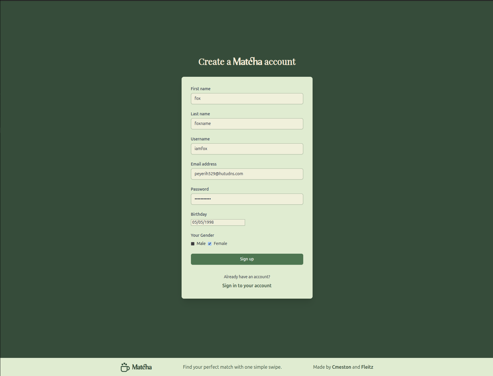
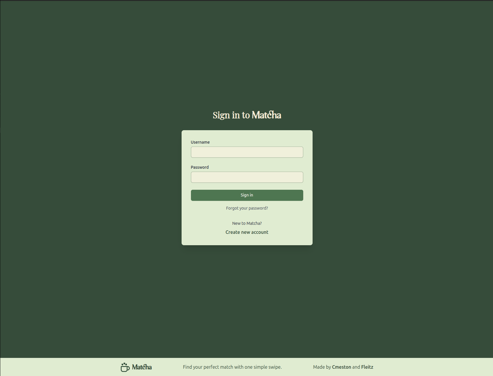
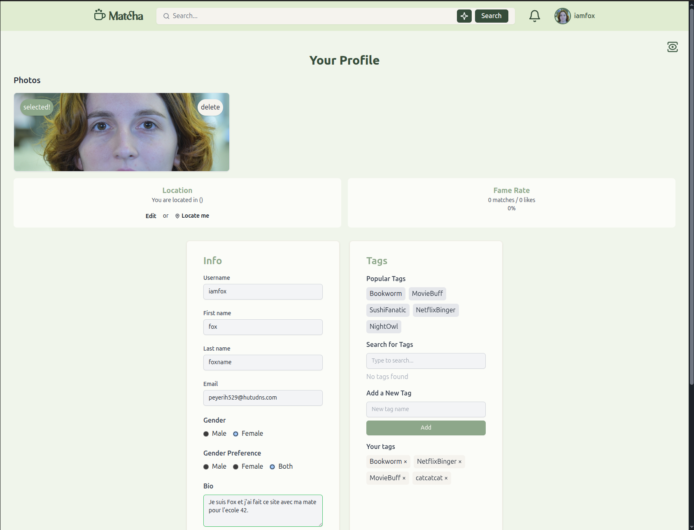
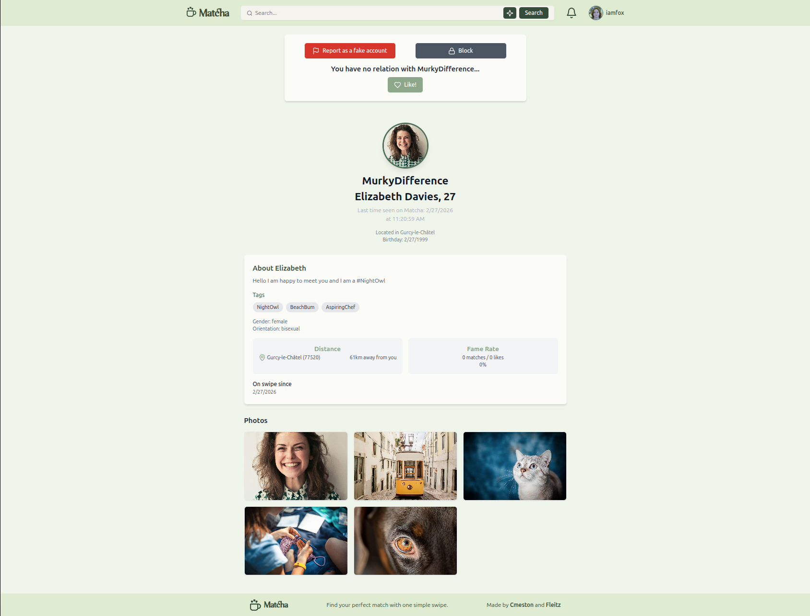
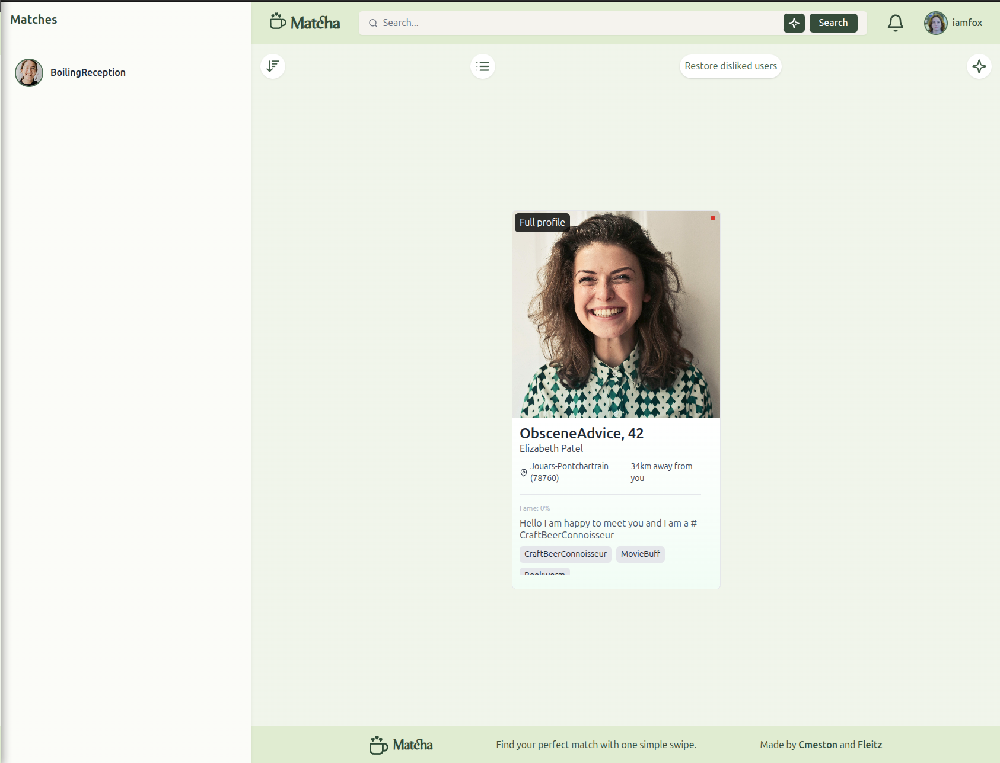
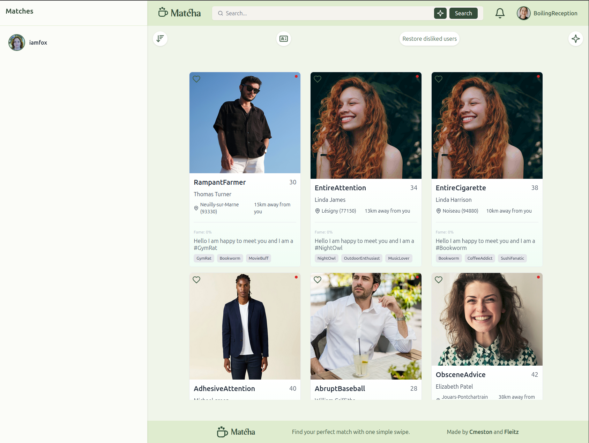
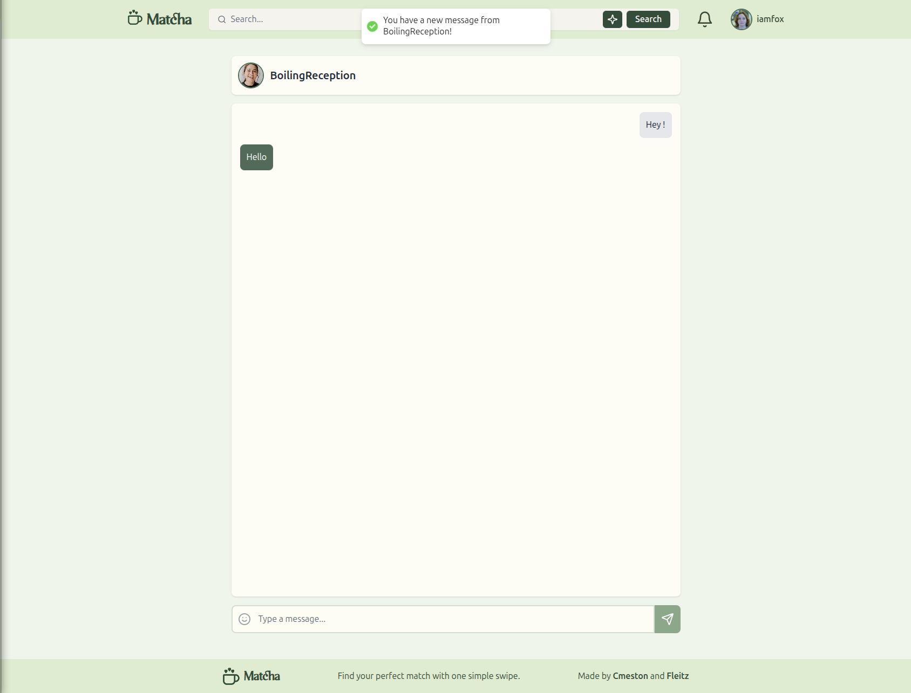
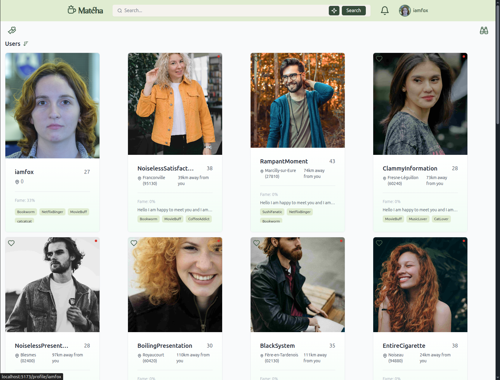
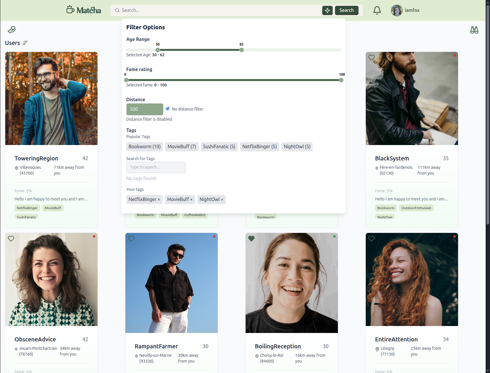

# Matcha - Full-Stack Dating Application

Full-stack dating application. Handles user profiles, likes, matches, real-time chat, and notifications.

42 school project **validated at 100/100**.

## Technologies
- Backend: Node.js + Express
- Frontend: React
- Database: PostgreSQL
- Web server: Nginx

## Project Overview
Matcha is a web-based dating platform designed to connect users based on preferences, location, and shared interests. Users can:
 - Create an account, verify their email, and log in securely
 - Build a complete profile with personal information, interests, and photos
 - Browse suggested profiles according to preferences, popularity, and proximity
 - Like or dislike other users and see mutual matches
 - Chat in real time with matched users
 - Receive notifications for likes, matches, messages, and profile views

The backend works with PostgreSQL for the database with advanced relational modeling. Complex queries handle matching, filtering by age, tags, distance, and popularity, while ensuring performance and data consistency.
The frontend is implemented in React, with a responsive design that works on desktop and mobile. The application server uses Express, and images are stored via Cloudinary.

### Note on Database & Queries
The PostgreSQL database is structured to efficiently manage users, matches, likes, chats, notifications, and tags. The queries are designed to handle complex matching logic and relational data, ensuring accurate results and smooth performance.

This project was developed in collaboration with [paigeh4rris](https://github.com/paigeh4rris).

## Screenshots
Signup

Login

My Profile

User Profile

Suggested Users with Card View

Suggested Users with List View

Sort Suggestion

Chat

Browse

Filters of Browser
